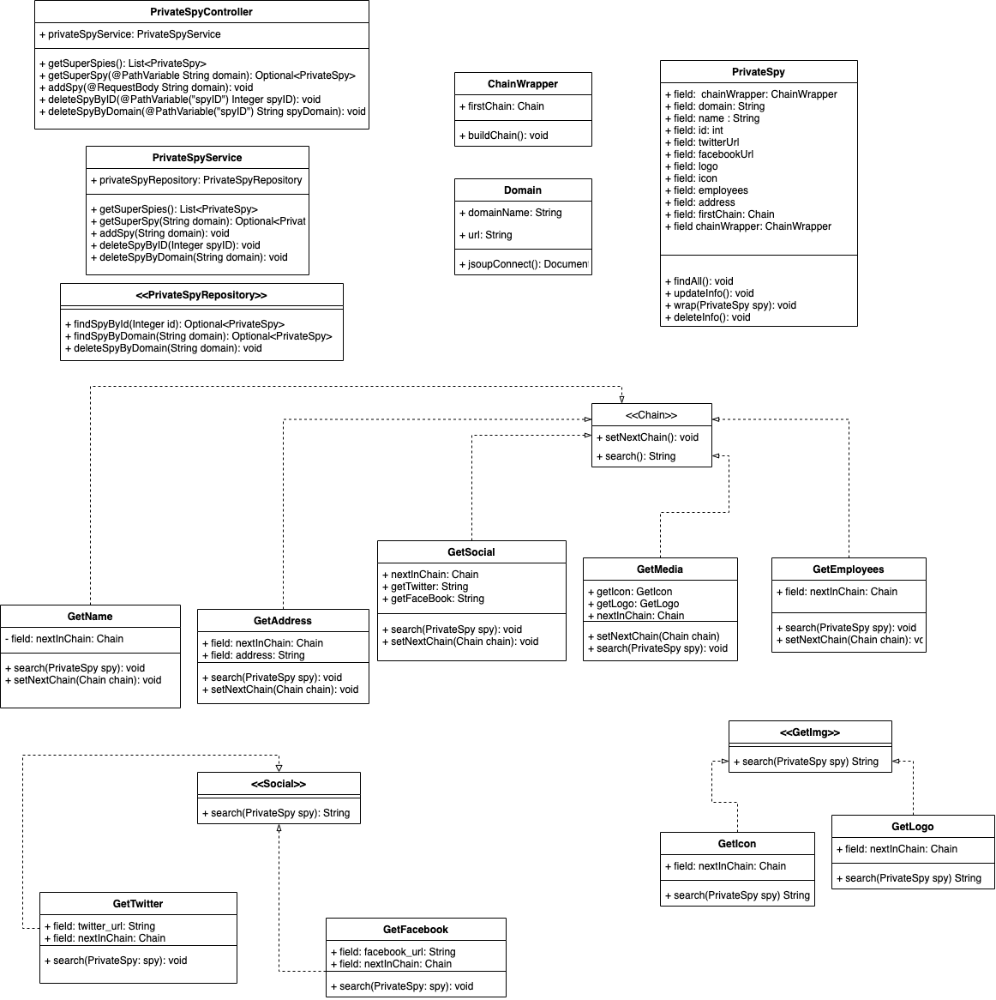
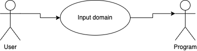
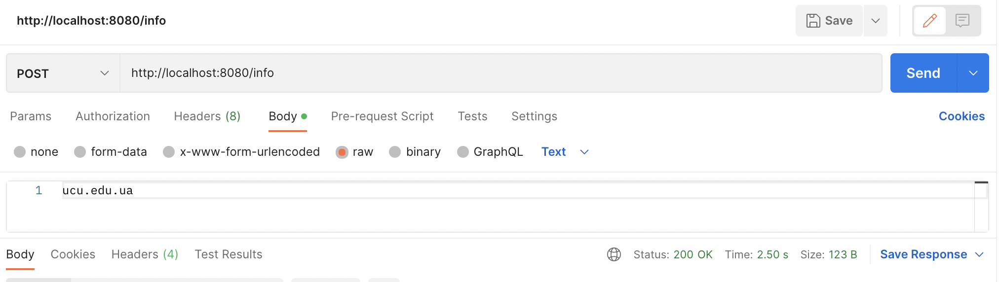
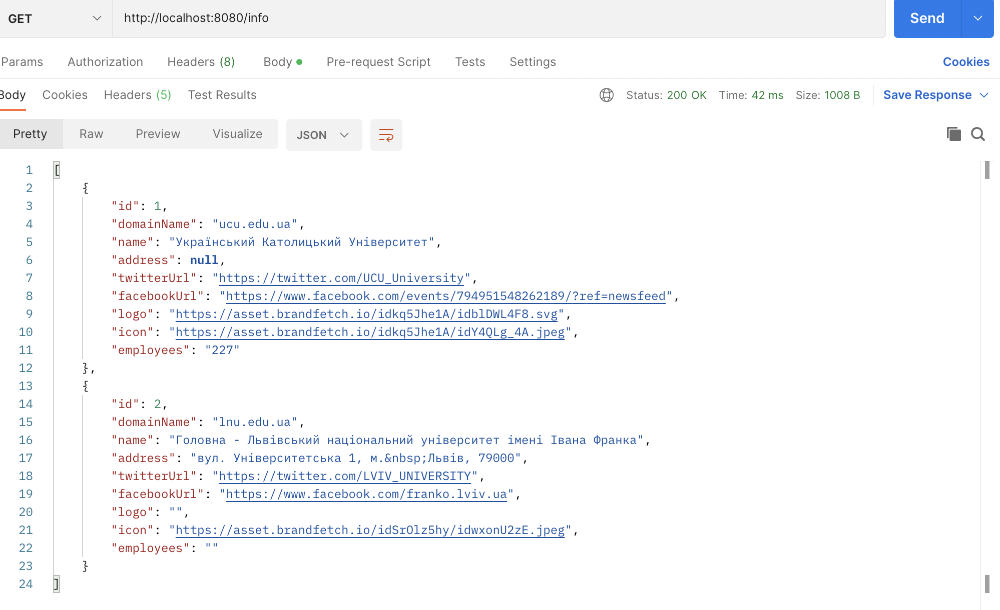

# PrivatSpy

### Authors: Senyk Anastasiia, Kocherkevych Victoria, Nahurna Olha, Prytula Matvii

## Design Patterns Used
Generally in order to implement the main logic of finding information for the user request we used Chain of responsibility design pattern. It helps us sequently search for the information units(such as twitter url, logo or address) and each class of chain after its job is done, calls the next one in chain, so that it can search for next piece of information.

Moreover, in order to set the whole chain, we used ChainWrapper which is basically the builder pattern, as it connects all the units of a chain and return complete first "vertex" 

Additionally, we know that the algorithm for finding Facebook and Twitter url is similar, but still differs a bit. Therefore, we used Strategy pattern to here. Same goes for finding logo and icon of the domain.(The interfaces are Social and GetImg respectively).

During the development process, we encountered the problem, that our units of Chain use different approaches to get the info, which each of them was responsible for. For example, to find Icon, the class uses domain name, whereas for twitter url finding, the so called “href” link was needed.  Thus, in order not to rewrite the whole logic of our project, we used adapter Strategy pattern and created class Domain, which makes the usage of both mentioned approaches possible.

In order to use the application, one has to send Post request with domain name, and after the post request is received via PrivatSpyController, service layer comes in handy. It calls first unit of chain in order to start searching for the info. In some states, we use two ways of parsing the information. For example, if jsoup does not manage to get address, we use pdl. Hopefully, it has the needed info

To see the available domains, that are all stored in the connected sql database, the get request is needed.

## UML & USERCASE diagram

## Usage example
**is presented in test.http**

## Heroku link
https://radiant-coast-85006.herokuapp.com/info

